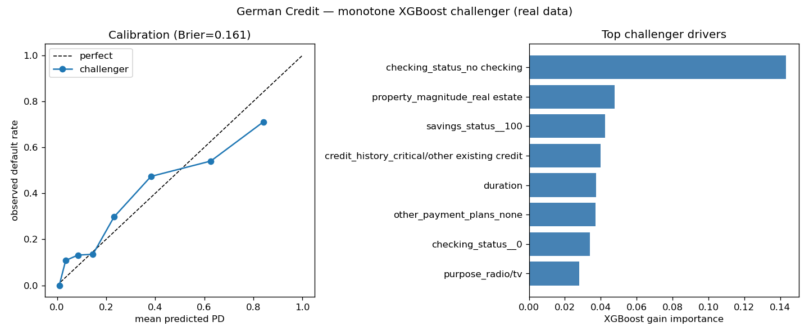

# Project 3 — Model-Risk & Validation Platform (RANK #2)

> **Result (real UCI German Credit).** Monotone-constrained XGBoost challenger AUC **0.812** beats the logistic
> champion (0.796); the **cost of monotonicity is ≈ 0** (−0.014 AUC — the constraint actually helps); scores are
> stable (PSI 0.04); and a disparate-impact test flags **younger applicants (adverse-impact ratio 0.665, fails
> the four-fifths rule)**. Market-risk VaR/ES engine: all five methods in the Basel green zone with ES backtests
> passing (on simulated returns). Full SR 11-7 write-up in [`reports/validation_report.md`](reports/validation_report.md).



**Thesis.** One validation discipline applied to two model classes, the way a real Model Risk Management group
works: (A) a **market-risk** VaR/Expected-Shortfall engine with the full regulatory backtesting suite, and
(B) a **credit-risk** PD model built the regulated way — WOE/IV scorecard (champion) vs monotonic-constrained
gradient boosting (challenger) — with discrimination, calibration, stability, SHAP, and fairness testing, wrapped
in an **SR 11-7 / Basel-aligned** validation report.

## Why it ranks #2 (build this alongside Project 4)
Uniquely owns the Risk / Model-Validation and sell-side-strats lanes, catalyzed by FRTB (US phased 2025→2028;
EU & UK delayed to Jan 1, 2027) and SR 11-7, runs entirely on FREE credit datasets, and is far less crowded than
trading projects. Together with Project 4 it covers all five lanes.

## What "done" looks like
> "VaR engine: historical/parametric/GARCH/EVT methods, each backtested with Kupiec POF, Christoffersen CC, and
> the Basel traffic-light zones; ES backtested per Acerbi-Szekely. Credit: champion scorecard AUC/KS vs monotone
> XGBoost challenger, with the *cost of monotonicity* quantified, PSI stability, calibration curves, SHAP, and a
> disparate-impact fairness section. Full validation report following SR 11-7 (effective challenge, limitations)."

## Layout
```
project3_model_risk/
├── IMPLEMENTATION_LOGIC.md
├── DATA.md
├── LLM_PROMPTS.md
├── requirements.txt
├── src/market_risk/var_backtests.py   # IMPLEMENTED: Kupiec, Christoffersen, Basel traffic light
├── src/market_risk/var_models.py      # IMPLEMENTED: historical/parametric/EWMA/GARCH-FHS/EVT VaR + ES
├── src/market_risk/es_backtests.py    # IMPLEMENTED: Acerbi-Szekely Z2 + ES traffic light
├── src/credit_risk/woe_scorecard.py   # IMPLEMENTED: WOE/IV + monotonic binning + scorecard scaling
├── src/credit_risk/challenger.py      # IMPLEMENTED: monotone-constrained XGBoost + cost of monotonicity
├── src/credit_risk/validation.py      # IMPLEMENTED: AUC/KS/Gini, calibration, PSI/CSI, SHAP, fairness
├── src/credit_risk/data.py            # IMPLEMENTED: synthetic + CSV/OpenML credit loaders
└── reports/validation_report.md       # IMPLEMENTED: SR 11-7 validation report (illustrative numbers)
```

## Status
All modules implemented with tests (no network/GPU in unit tests; SHAP mocked). The SR 11-7 report in
`reports/validation_report.md` is populated with **real outputs on synthetic data** — e.g. challenger AUC
0.889, cost of monotonicity ≈ 0, all five VaR methods in the Basel green zone, and a disclosed fairness
finding (adverse-impact ratio 0.589, fails four-fifths via an income proxy). Swap in free real data
(Home Credit / Give-Me-Some-Credit; yfinance + FRED) to regenerate.

## References
- Board of Governors of the Federal Reserve / OCC (2011). *SR 11-7 — Guidance on Model Risk Management.*
- Basel Committee on Banking Supervision (1996). *Supervisory Framework for the Use of "Backtesting".*
- BCBS — *Fundamental Review of the Trading Book (FRTB)*, stressed Expected Shortfall.
- Kupiec, P. (1995). *Techniques for Verifying the Accuracy of Risk Measurement Models.* J. Derivatives.
- Christoffersen, P. (1998). *Evaluating Interval Forecasts.* International Economic Review.
- Acerbi, C. & Székely, B. (2014). *Backtesting Expected Shortfall.* Risk.
- McNeil, Frey & Embrechts. *Quantitative Risk Management* (EVT / peaks-over-threshold).
- Data: [UCI German Credit](https://archive.ics.uci.edu/dataset/144/statlog+german+credit+data) via OpenML.
